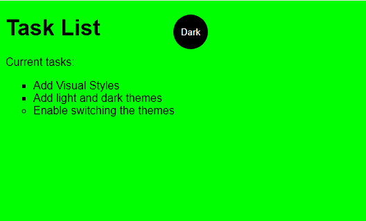

# 🐠 Simple Theme Switcher

As a student, I'm always looking for something new to practice and I really love free courses that are available all over the Web. So I decided to take this one about "themes toggling" to practice CSS and JS and afterward try to build a new project more complex and useful having this one as a base (this is a project for another day).

This project is a fundamental web application developed during a course at [**Bradesco Foundation (Fundação Bradesco)**](https://www.ev.org.br/). It represents my early steps in learning how to manipulate the DOM and manage styles dynamically.
 
 

  

---

## ✨ Features

* **Light & Dark Theme:** Switch between two visual modes with a single click.
* **CSS Variables:** Efficient color management using `:root` variables.
* **Responsive Logic:** Simple and clean JavaScript implementation.

## 🛠️ Tech Stack

* **HTML5:** Basic structure for the task list.
* **CSS3:** Styling and theme definitions (`light-theme` vs `dark-theme`).
* **JavaScript:** Handling the click event and toggling classes.

---

## 🦈 Evolution

This "small fish" project was the core inspiration for my larger and more complex projects, like **StyleMix**, where I took these theme concepts to a professional level!
